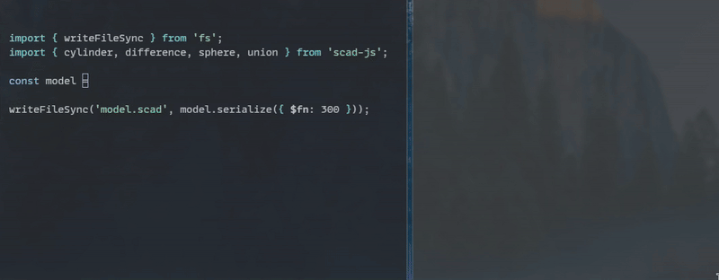

<h1 align="center">
  <br>
  scad-js
</h1>

<p align="center">
  <strong>Write TypeScript. Get 3D models.</strong><br>
  <sub>TypeScript → OpenSCAD compiler. Fluent API. Type safe. npm-powered.</sub>
</p>

<p align="center">
  <a href="https://www.npmjs.com/package/scad-js"></a>
  <a href="https://codecov.io/gh/scad-js/scad-js"></a>
  <a href="LICENSE"></a>
</p>

<p align="center">
  
</p>

---

OpenSCAD is great at 3D modeling. Its language — not so much. No real variables, barely usable loops, zero IDE support.

**scad-js** lets you write TypeScript instead and compiles it to OpenSCAD.

- **Fluent API** — `cube(10).rotate_z(45).color('tomato')`
- **Real JavaScript** — loops, `Math.sin`, functions, the entire npm ecosystem
- **Type-safe** — catch errors in your editor, not after a 10-minute render
- **Two outputs** — `.serialize()` → `.scad` file, or `.render()` → STL directly via WASM

## Quickstart

```bash
bun add scad-js
```

Create `model.ts`:

```typescript
import { cube, sphere, difference } from 'scad-js'
import { writeFileSync } from 'fs'

const model = difference(cube(10), sphere(7))
writeFileSync('model.scad', model.serialize())
```

```bash
bun model.ts
```

Open `model.scad` in [OpenSCAD](https://www.openscad.org/downloads.html). Press **F5**. Done.

> **No OpenSCAD installed?** Render straight to STL:
> ```typescript
> const stl = await model.render()
> writeFileSync('model.stl', stl)
> ```

<details>
<summary><strong>Full project setup</strong></summary>

Start from scratch:

```bash
mkdir my-project && cd my-project
bun init -y
bun add scad-js
```

Or grab the [starter template](https://github.com/scad-js/scad-js-starter):

```bash
git clone https://github.com/scad-js/scad-js-starter.git my-project
cd my-project && bun install
```

</details>

## Examples

A Möbius strip — loops + `hull`, 8 lines of modeling:

```typescript
import { cylinder, hull, union, type ScadObject } from 'scad-js'

const wall = (p: number) => cylinder(20, 1)
  .rotate([p, 0, 0])
  .translate([0, 40, 0])
  .rotate([0, 0, 2 * p])

const walls: ScadObject[] = []
for (let i = 0; i <= 360; i += 5)
  walls.push(hull(wall(i), wall(i + 5)))

const mobiusStrip = union(...walls)
```

Turner's cube — `.map()` + functional composition:

```typescript
import { cylinder, cube, difference, union } from 'scad-js'

const cy3 = (x: number) => union(
  cylinder(12, x / 2).rotate([90, 0, 0]),
  cylinder(12, x / 2).rotate([0, 90, 0]),
  cylinder(12, x / 2).rotate([0, 0, 90]),
)
const cutCube = (x: number) => difference(cube(x), cy3(x - 0.5))
const turnersCube = union(...[4, 6, 8, 10].map(x => cutCube(x)))
```

**[See all examples →](./examples)** — gears, DSA keycaps, hollowed cubes, and more.

---

<p align="center">
  <a href="https://github.com/scad-js/scad-js-docs"><strong>Documentation</strong></a> ·
  <a href="./examples"><strong>Examples</strong></a> ·
  <a href="https://github.com/scad-js/scad-js-starter"><strong>Starter Template</strong></a>
</p>

---

Built on [OpenSCAD](https://www.openscad.org). Inspired by [scad-clj](https://github.com/farrellm/scad-clj), [OpenJSCAD](https://openjscad.org/), and [scadjs](https://github.com/tasn/scadjs).

[MIT License](LICENSE)
